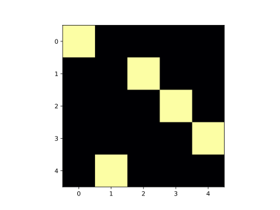

---
jupytext:
  cell_metadata_filter: all,-hidden,-heading_collapsed,-run_control,-trusted
  encoding: '# -*- coding: utf-8 -*-'
  notebook_metadata_filter: all, -jupytext.text_representation.jupytext_version, -jupytext.text_representation.format_version,
    -language_info.version, -language_info.codemirror_mode.version, -language_info.codemirror_mode,
    -language_info.file_extension, -language_info.mimetype, -toc
  text_representation:
    extension: .md
    format_name: myst
kernelspec:
  display_name: Python 3 (ipykernel)
  language: python
  name: python3
language_info:
  name: python
  nbconvert_exporter: python
  pygments_lexer: ipython3
nbhosting:
  title: 'TP: les reines'
---

# le problème des reines

+++

## modalités

+++

dans cet exercice, vous allez devoir écrire un module qui s'appelle `rooks_and_queens.py`

et à la fin du TP, vous devez pouvoir tester votre code en faisant

```bash
# vous pouvez faire `pytest` tout court aussi

$ pytest test_rooks_and_queens.py
================================ test session starts ================================
platform darwin -- Python 3.10.8, pytest-7.2.0, pluggy-1.0.0
rootdir: /Users/tparment/git/flotpython-exos/python-tps/queens
plugins: anyio-3.6.2
collected 3 items

test_rooks_and_queens.py ...                                                  [100%]

================================ 3 passed in 14.19s =================================
```

mais bien sûr d'ici là, n'hésitez pas à lancer votre code interactivement et le debugger, soit dans ce notebook, soit dans ipython, etc..

+++

## les tours

+++

on se place sur un échiquier de taille $n \times n$

on cherche à écrire un générateur qui énumère **les positions de $n$ tours** qui ne se menacent pas les unes les autres

+++

### système de coordonnées

les positions que l'on cherche ont toutes une bonne propriété, c'est que de par l'énoncé du problème on ne peut avoir qu'une position occupée sur chaque colonne de l'échiquier

aussi, pour se simplifier la vie

* plutôt que de manipuler des positions sur l'échiquier sous la forme de tuples $(x, y)$, 
* on va **se contenter d'un tuple** - ou d'une liste, peu importe - **de coordonnées Y**

c'est ainsi qu'on va représenter une position, comme par exemple celle-ci


par le tuple `(0, 4, 1, 2, 3)` qui donne les coordonnées en Y dans les colonnes successives (ici le dessin est fait avec matplotlib, du coup les Y sont descendants, l'orientation n'a pas importance)

+++

### ce qu'on doit pouvoir faire

```{code-cell} ipython3
y=(1,)
y[:0]
```

```{code-cell} ipython3
# dans ce notebook on importe le code de démonstration
# mais bien sûr à la fin de l'exercice vous pourrez exécuter ça
# avec votre propre code
from rooks_and_queens import rooks
```

```{code-cell} ipython3
r3 = rooks(3)

# une première solution
next(r3)
```

```{code-cell} ipython3
# une autre
next(r3)
```

```{code-cell} ipython3
# et ainsi de suite
next(r3)
```

```{code-cell} ipython3
# on a déjà consommé 3 des 6 positions :
# si on fait une boucle for on ne voit plus que les 3 dernières

for position in r3:
    print(position)    
```

### à quoi ça ressemble ?

il ne vous aura pas échappé que le problème est équivalent à énumérer les permutations de $n$ (et c'est d'ailleurs pour ça qu'on peut se permettre de retourner une liste d'entiers, et non pas des tuples)

donc du coup on pourrait faire tout simplement

```{code-cell} ipython3
from itertools import permutations

def cheated_rooks(n):
    return permutations(range(n))
```

```{code-cell} ipython3
# et en effet
for p in cheated_rooks(3):
    print(p)
```

mais bon pour cet exercice on va vous demander de réfléchir à une façon de **faire ça vous-même** à la main, sans recourir à `itertools` donc...

```{code-cell} ipython3
# à vous d'écrire le code de la fonction (un générateur donc) rooks
def rooks(n):
    if n==1:
        yield [0,]
    else:
        for y in rooks(n-1):
            x = [n-1] + y
            yield x
            for i in range(n-1):
                x[i], x[i+1] = x[i+1], x[i]
                yield x
```

```{code-cell} ipython3
for L in rooks(3):
    print(L)
```

```{code-cell} ipython3
s=set()
s.add(2)
```

```{code-cell} ipython3
s.add(3)
s
```

## les reines

+++

forts de cet outil, on va maintenant vous demander d'énumérer **les positions des reines** qui ne se menacent pas les unes les autres

```{code-cell} ipython3
# ce qui donnerait ceci

from rooks_and_queens import queens
```

```{code-cell} ipython3
for p in queens(4):
    print(p)
```

```{code-cell} ipython3
# votre code pour définir queens
def queens(n):
    for possibility in rooks(n):
        if is_queen_positions(possibility):
            yield possibility

def is_queen_positions(t):
    diff, add = [], [] 
    for x,y in enumerate(t):
        if x-y in diff:
            return False
        if x+y in add:
            return False
        diff.append(x-y)
        add.append(x+y)
    return True
        
        
```

## modalités (2)

+++

### pour travailler en local

on vous fournit comme artefacts:

* ce notebook
* un dossier media/ avec la·es figure·s
* un fichier de test `test_rooks_and_queens.py`

ce dernier est un fichier de test pour valider votre code; c'est un exercice pour commencer à utiliser un framework de test (ici on va utiliser `pytest`)

au fur et à mesure que votre code marche, mettez-le dans un fichier `rooks_and_queens.py`, dans le même dossier

+++

avec ce setup
* depuis le notebook, quand vous importez `rooks_and_queens`, vous importez votre code
* et depuis le terminal, si vous exécutez (dans le dossier en question bien sûr)
  
  ```bash
  # une seule fois suffit bien sûr
  pip install pytest
  
  # et ensuite pour tester
  pytest
  ```
  
  alors vous exécutez les tests qui sont définis dans ce fichier de tests unitaires

+++

l'idée générale, c'est d'utiliser un workflow classique, qui consiste en ceci :

* vous commencez à travailler directement dans le notebook
* une fois que le code marche raisonnablement, vous extrayez votre code pour le ranger dans un module Python normal
* que vous pouvez importer depuis le notebook, toutes les visualisations continuent à fonctionner
* et en plus comme ça le code devient réutilisable - depuis un autre notebook, ou depuis un programme classique
* et en plus on peut le tester facilement

+++ {"tags": ["level_intermediate"]}

## pour les rapides

cette partie est optionnelle

+++

### calculer la taille (longueur) d'un générateur

on ne peut pas utiliser `len()` sur un générateur (pourquoi ?)  
comment feriez-vous pour calculer le nombre d'éléments dans un générateur ?

```{code-cell} ipython3
# écrivez generator_size

from rooks_and_queens import generator_size
generator_size(queens(8))
```

### dessin

+++

si vous avez fini avant tout le monde, dessinez les résultats avec numpy.imshow, ou autre outil de visualisation

```{code-cell} ipython3
%matplotlib inline

from rooks_and_queens import draw_position
```

```{code-cell} ipython3
for p in queens(4):
    print(p)
    draw_position(p)
```

```{code-cell} ipython3
for p in queens(6):
    print(p)
    draw_position(p)
```

### éliminez les symétries

plus dur, éliminez les symétries et rotations

il y a plein de façons d'envisager la question, idéalement on doit pouvoir écrire un itérateur `uniques` qu'on pourra en quelque sorte chainer avec les deux algorithmes qu'on vient d'écrire

```{code-cell} ipython3
# c'est à dire qu'on veut pouvoir écrire quelque chose comme ceci
from rooks_and_queens import uniques
```

```{code-cell} ipython3
# comme vous pouvez le voir plus haut, les solutions de queens(6)
# sont toutes les mêmes mais tournées à chaque fois d'1/4 de tour
# aussi quand on passe par uniques() il n'en reste qu'une
for p in uniques(queens(6)):
    draw_position(p)
```

```{code-cell} ipython3
# en dimension 5 curieusement il y en a plus que pour n=6
for p in uniques(queens(5)):
    draw_position(p)
```

```{code-cell} ipython3
# combien reste-t-il de permutations uniques 
# une fois qu'on a éliminé les rotations et symétries
# sur les 120 de S5

generator_size(uniques(rooks(5)))
```

```{code-cell} ipython3

```
